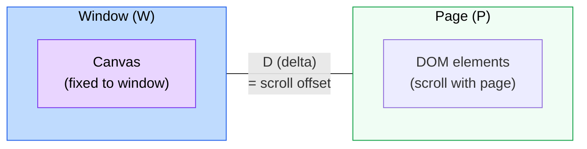
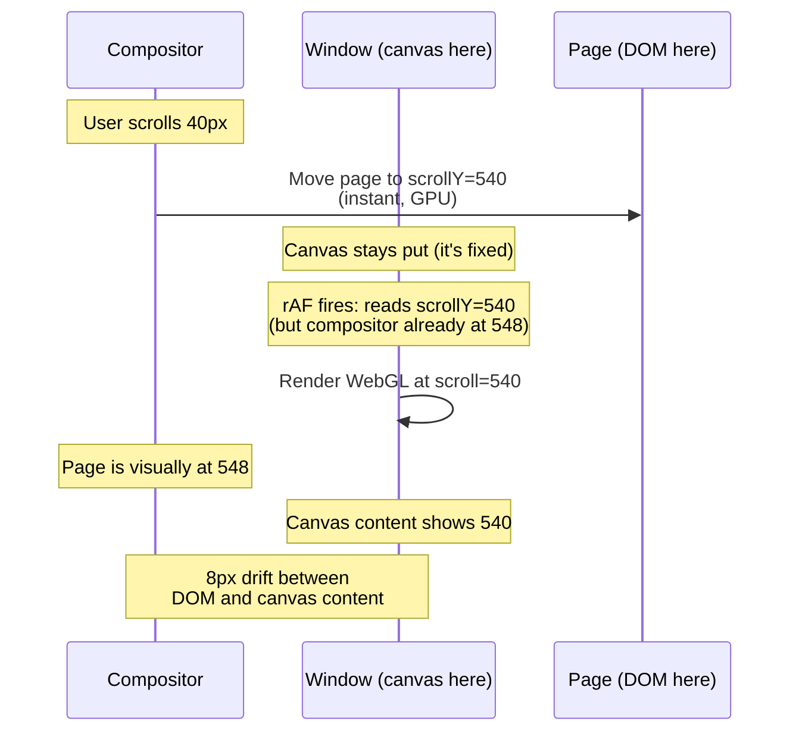
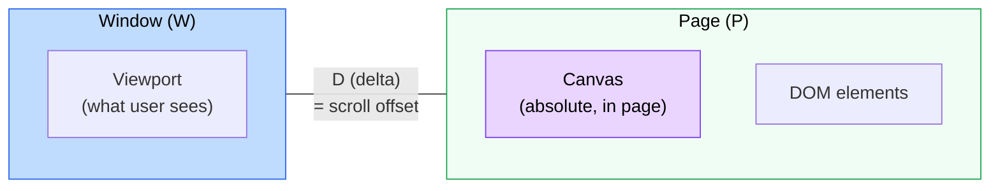
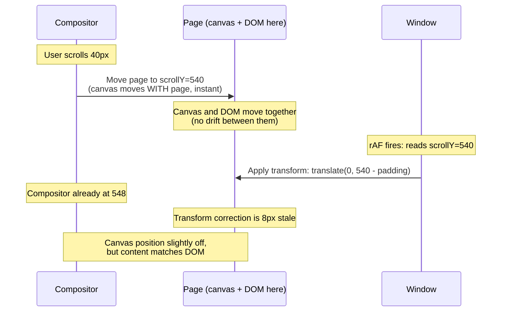
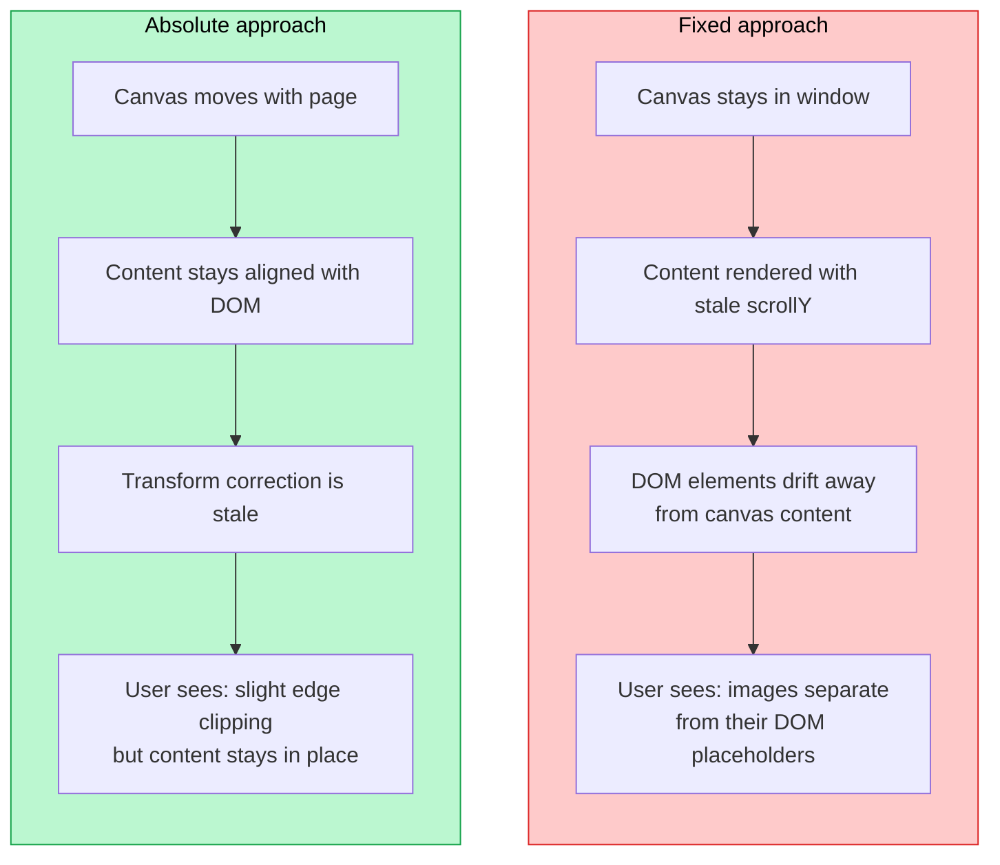

## The jelly problem

You have a WebGL canvas pinned with `position: absolute` inside the page flow. You sync its position to scroll via `requestAnimationFrame`. It works, mostly. But during fast scrolls, the canvas visibly wobbles -- content stretches and compresses like jelly, drifting a few pixels before snapping back. It's subtle on a trackpad and obvious on a mouse wheel.

This isn't a bug in your code. It's a fundamental timing conflict between the browser's **compositor thread** and the **JS main thread**.

## Two threads, one scroll position

Modern browsers split rendering into two threads:

- **Main thread**: runs JavaScript, computes styles, performs layout, paints display lists
- **Compositor thread** (Chromium calls it the "impl thread"): composites rasterized layers, handles scroll input, runs GPU-side animations

When you scroll, the input event goes to the **compositor thread first**, not JavaScript. The compositor immediately shifts rasterized pixel tiles on the GPU. No layout, no style recalc, no JS. That's why scrolling stays smooth even when your main thread is busy.


The compositor updates what the user sees **immediately**. The main thread gets the memo **later** -- often an entire frame later.

## The rAF timing gap

Here's what happens inside a single frame when you read `window.scrollY` in a `requestAnimationFrame` callback:


Between the time your rAF reads `scrollY` and the compositor draws the next frame, the compositor may have already advanced the scroll position by several more pixels. Your canvas transform is based on **stale data**.

## Why [position: absolute] makes it worse

A `position: absolute` element inside the page flow participates in compositor scrolling. When the compositor scrolls the page, it physically moves all elements in the scroll container -- including your absolute-positioned canvas wrapper. But here's the conflict: you're *also* applying a transform to that element via JavaScript to position it.


The container is being pulled in two directions: the compositor has physically moved it to one position, but your JS-driven transform is applying an offset calculated from a slightly older scroll value. The result: the container's visual position doesn't match where the transform says it should be.

## The compositor pipeline in detail

To understand why the lag is unavoidable with this architecture, look at Chromium's rendering pipeline:


For compositor-driven scroll, **steps 1-3 (Style, Layout, Paint) can be entirely skipped**. The compositor just shifts rasterized tiles. But when you modify a transform via JS, the change has to go through the full pipeline: your rAF sets the value on the main thread, it gets committed to the impl thread, layerized, rasterized, activated, and finally drawn.

That pipeline has minimum 1-frame latency. The compositor's scroll position has **zero** latency. The mismatch is architectural.

## The dual-tree model

Chromium's compositor maintains two independent layer trees:


These two trees are **completely isolated**. The impl tree is a snapshot from the last commit. Between commits, the impl thread scrolls, animates, and draws frames without consulting the main thread at all. When your rAF fires and reads `window.scrollY`, it's reading the scroll offset from the *last time the impl thread notified the main thread* -- not the impl thread's current position.

## Quantifying the lag

Firefox's APZ (Async Pan/Zoom) documentation gives the most precise frame-level breakdown:


Under ideal conditions the JS-driven effect is **1 frame behind** the compositor scroll. Under main-thread load (GC pauses, layout thrashing, heavy React renders), it can be 2-3 frames behind. At 60fps, that's 16-48ms of positional drift.

## The code that causes it

Here's the typical pattern. It looks correct but produces jelly:

```ts showLineNumbers
// The problematic pattern
const container = document.querySelector('.webgl-container')

function animate() {
  requestAnimationFrame(animate)

  // 1. scrollY is stale (1+ frames behind compositor)
  const y = window.scrollY

  // 2. Transform applied based on stale value
  container.style.transform = `translate3d(0, ${y - paddingOffset}px, 0)`

  // 3. But the compositor has already visually moved the container further
  // 4. Result: visual position != transform position → jelly
}

animate()
```

The same problem exists in WebGL when syncing camera position to scroll:

```ts showLineNumbers
function animate() {
  requestAnimationFrame(animate)

  // Same staleness problem -- camera position
  // lags behind what the user actually sees
  camera.position.y = -window.scrollY * scrollFactor
  renderer.render(scene, camera)
}
```

## Fixed vs absolute: two sides of the same lag

Both approaches suffer from the same 1-frame compositor lag. The difference is **which side of the equation is stale**.

There are three things in play: the **window** (viewport), the **page** (document), and the **delta** (scroll offset between them). The compositor owns the scroll. JS reads it late. The question is: where does your canvas live?

### The fixed approach

The canvas is `position: fixed` -- it lives in **window** space. It doesn't move when the page scrolls. To sync WebGL content with DOM elements, JS needs to know the delta (how far the page has scrolled) and shift the canvas content accordingly.



The canvas sits on the **W** side. The compositor moves the page, but JS can't read that new delta until the next frame. So the canvas content tracks the page **one frame late**:



**The canvas doesn't move, but its content is wrong.** The WebGL scene is rendered with a scroll value that's already stale. DOM elements (on the page side) have moved further than what the canvas is showing.

### The absolute approach

The canvas is `position: absolute` -- it lives in **page** space. It scrolls naturally with the DOM. To keep it covering the viewport, JS applies a `transform` to offset it back into view.



The canvas sits on the **P** side. The compositor moves the page (and the canvas with it) instantly. But JS needs to know the window position to apply the correction transform, and that read is **one frame late**:



**The canvas moves with the DOM, but its position correction is late.** The content stays aligned with surrounding DOM elements (they're all on the page side, moving together on the compositor). The only thing that's stale is the `transform` that repositions the canvas to cover the viewport.

### Why absolute wins

The key insight: **what drifts is different**.



| | Fixed | Absolute |
|---|---|---|
| **Canvas lives in** | Window (W) | Page (P) |
| **What's stale** | The scroll delta (D) used to render content | The window position (W) used for transform correction |
| **What drifts** | Canvas content vs DOM elements | Canvas edges vs viewport bounds |
| **Visible as** | Images visibly separating from placeholders | Slight clipping at canvas edges during fast scroll |

With the fixed approach, the **content** is wrong -- WebGL-rendered images drift away from their DOM counterparts. With the absolute approach, the **positioning** is slightly off -- the canvas edges might not perfectly cover the viewport, but the content inside stays locked to the DOM.

Edge clipping is solved by adding vertical padding. Render the canvas at 150% viewport height (25% extra top and bottom), and even with a few frames of stale transform, the visible area stays covered.

### The scroll hijack alternative

There's a third option: detach the compositor from scrolling entirely. Set `overflow: hidden`, make the body tall for a scrollbar, fix the content, and move it yourself via JS.

This makes JS the **single source of truth** for scroll position. You read `scrollY` and apply it to both the HTML content and the canvas **in the same rAF callback**, before either one paints. No compositor race, no delta mismatch, zero drift.

The problem: you've killed native scroll. The compositor is no longer helping you. Every scroll frame runs through the main thread. On mobile, where the main thread gets overloaded by touch handlers, GC pauses, and layout work, this means **perceptibly laggy scrolling**. The smoothness users expect from native scroll is gone.

For a reference implementation of the absolute approach (with padding), see [webgl-scroll-sync](https://github.com/matiasperz/webgl-scroll-sync).

## Why smooth scroll fixes this

When you enable CSS `scroll-behavior: smooth` or use a JS-based smooth scroll (lerp/interpolation), you fundamentally change the scroll dynamics:

### Without smooth scroll (native/instant)


With instant scroll, the compositor can jump large distances between frames. A single wheel tick might advance 40-100px. If your rAF is 1 frame behind, that's 40-100px of positional mismatch -- very visible jelly.

### With smooth scroll (interpolated)


Smooth scroll spreads the same 40px delta over many frames with an easing curve. The per-frame delta drops from 40px to ~4px. Even with 1 frame of lag, the mismatch is only a few pixels -- below the threshold of human perception.

### The math

| Scroll type | Delta per wheel tick | Frames to complete | Per-frame delta | Lag (1 frame) | Visible? |
|---|---|---|---|---|---|
| **Instant** | 40-100px | 1 | 40-100px | 40-100px | Yes |
| **Smooth** | 40-100px | ~10 | 4-10px | 4-10px | No |

Smooth scroll doesn't eliminate the compositor/JS timing gap. It makes the gap **too small to see**.

## The lerp approach

If you can't use CSS `scroll-behavior: smooth` (e.g., you need scroll hijacking for a WebGL experience), the same principle applies with JS-side interpolation:

```ts showLineNumbers
let currentY = 0
const lerp = (a: number, b: number, t: number) => a + (b - a) * t

function animate() {
  requestAnimationFrame(animate)

  // Instead of jumping to scrollY, ease toward it
  currentY = lerp(currentY, window.scrollY, 0.1)

  // The transform is always close to (but smoothly trailing) the real position
  container.style.transform = `translate3d(0, ${currentY - paddingOffset}px, 0)`
}
```

This works for the same reason: you're artificially limiting the per-frame delta. The 1-frame compositor lag gets absorbed into the easing, making it invisible.


Without lerp, every jump in `scrollY` translates 1:1 to a jump in transform position -- and the 1-frame compositor lag makes those jumps misaligned. With lerp, the transform trails behind smoothly. There's nothing for the compositor lag to "tear" against.

## Other approaches and their tradeoffs

### [position: fixed] + scroll hijack

Many libraries (Locomotive Scroll, Lenis, GSAP ScrollSmoother) disable native scrolling entirely:

```ts
document.body.style.overflow = 'hidden'
document.body.style.height = `${contentHeight}px`
container.style.position = 'fixed'
container.style.top = '0'

// Translate the container yourself
function animate() {
  requestAnimationFrame(animate)
  currentY = lerp(currentY, window.scrollY, 0.1)
  container.style.transform = `translate3d(0, ${-currentY}px, 0)`
}
```

This sidesteps the compositor conflict entirely because `position: fixed` elements aren't scrolled by the compositor. The container stays put, and you move it yourself. But you lose:
- Browser find-in-page
- Anchor link navigation
- Accessibility (screen readers)
- Scroll restoration
- `position: fixed` children (they position relative to the transformed parent, not the viewport)

### CSS Scroll-Driven Animations

The modern, compositor-native solution:

```css
.webgl-container {
  animation: sync-scroll linear;
  animation-timeline: scroll();
}

@keyframes sync-scroll {
  from { transform: translate3d(0, 0, 0); }
  to { transform: translate3d(0, -100%, 0); }
}
```

Scroll-driven animations run **entirely on the compositor thread**. No JS, no rAF, no stale `scrollY`. The compositor applies the transform in the same pass that it applies the scroll offset, guaranteeing zero lag. This is the correct long-term solution but requires the effect to be expressible as a CSS animation, which doesn't work for WebGL camera sync.

### [will-change: transform] on the container

```css
.webgl-container {
  will-change: transform;
}
```

This promotes the element to its own compositor layer, which can reduce jank from repaint but does **not** fix the timing mismatch. The transform value is still set by the main thread and committed asynchronously. It helps with paint performance, not with compositor sync.

## Summary


| Approach | Compositor lag eliminated? | Downsides |
|---|---|---|
| **Smooth scroll** | No, but lag is imperceptible | Slight delay in reaching target position |
| **Lerp/interpolation** | No, but lag is absorbed into easing | Adds perceived inertia; tuning `t` is subjective |
| **CSS Scroll-Driven Animations** | Yes (runs on compositor) | Can't drive WebGL camera; limited to CSS properties |
| **Scroll hijack** | Yes (bypasses compositor scroll) | Breaks accessibility, find-in-page, anchor links |

For WebGL scroll sync, smooth scroll (or lerp) is the pragmatic fix. You can't eliminate the architectural gap between the compositor and JS. You can make it invisible.
