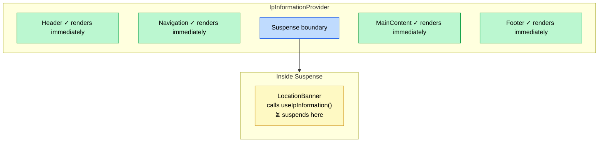
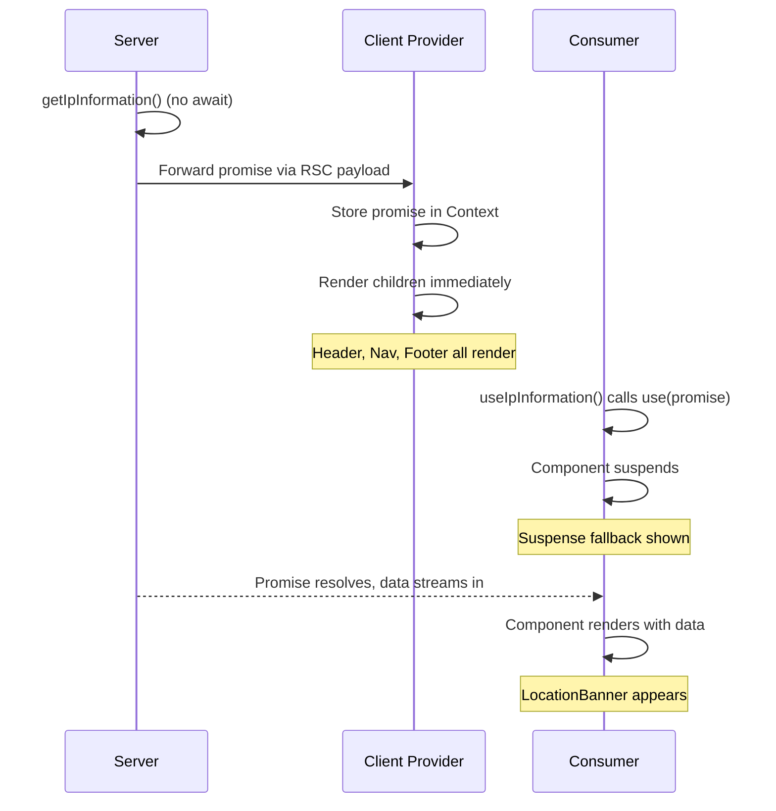

## The problem

You have data that can only be fetched on the server — request headers, database queries, secrets — but you need it available to many client components across your app. There are three common approaches, and they all have tradeoffs.

### 1. Fetch on the server, `await`, pass as prop

```tsx
// app/layout.tsx
export default async function Layout({ children }) {
  const ipInfo = await getIpInformation() // ⏳ blocks everything

  return (
    <IpInfoProvider value={ipInfo}>
      {children}
    </IpInfoProvider>
  )
}
```

This blocks the entire render tree. Nothing renders until the fetch resolves. Every child waits, even the ones that don't need the data.

### 2. Fetch on the client

You lose access to server-only APIs (`headers()`, direct DB access, secrets). And you add a network round-trip that didn't need to exist.

### 3. Resolve in a client provider with `use()`

```tsx
// ❌ Don't do this
export function IpInfoProviderClient({ ipInfoPromise, children }) {
  const ipInfo = use(ipInfoPromise) // suspends the ENTIRE subtree

  return (
    <IpInfoContext.Provider value={ipInfo}>
      {children}
    </IpInfoContext.Provider>
  )
}
```

Now the entire provider subtree suspends. Header, navigation, footer, everything inside the provider is blocked. Not just the components that actually need the data.

## Pass the promise, resolve at the consumer

The key insight: you can pass an **unresolved promise** from a Server Component to a Client Component as a prop. React's serialization boundary handles this — promises are a valid serializable type across the server/client boundary.

The trick is deferring resolution to the individual consumers:

```
Server Component          Client Provider           Consumer Hook
─────────────────       ───────────────────       ─────────────────
                        stores promise in          calls use(promise)
calls async fn() ──►    React Context     ──►     suspends HERE
(does NOT await)        (does NOT resolve)         at its own <Suspense>
```

### Step 1: Server-only data fetching

```ts showLineNumbers
// lib/ip-information.ts
import "server-only"
import { headers } from "next/headers"

type IpInformation = {
  ip: string | null
  city: string | null
  country: string | null
}

export async function getIpInformation(): Promise<IpInformation> {
  const headersList = await headers()

  return {
    ip: headersList.get("x-forwarded-for")?.split(",")[0]?.trim() ?? null,
    city: headersList.get("x-vercel-ip-city") ?? null,
    country: headersList.get("x-vercel-ip-country") ?? null,
  }
}
```

This function uses `headers()` — a server-only Next.js API. It cannot run on the client.

### Step 2: Server Component — start the promise, don't await it

```tsx showLineNumbers
// providers/ip-information/index.tsx (Server Component)
import { getIpInformation } from "@/lib/ip-information"
import { IpInformationProviderClient } from "./client-provider"

export function IpInformationProvider({
  children,
}: {
  children: React.ReactNode
}) {
  const ipInformationPromise = getIpInformation() // no await

  return (
    <IpInformationProviderClient
      ipInformationPromise={ipInformationPromise}
    >
      {children}
    </IpInformationProviderClient>
  )
}
```

By not awaiting, the promise starts resolving in the background while React continues rendering the tree. The Server Component doesn't block.

### Step 3: Client Provider — store the promise, don't resolve it

```tsx showLineNumbers
// providers/ip-information/client-provider.tsx
"use client"

import { createContext, useContext, use } from "react"

type IpInformation = {
  ip: string | null
  city: string | null
  country: string | null
}

const IpInformationContext = createContext<Promise<IpInformation> | null>(null)

export function IpInformationProviderClient({
  ipInformationPromise,
  children,
}: {
  ipInformationPromise: Promise<IpInformation>
  children: React.ReactNode
}) {
  return (
    <IpInformationContext.Provider value={ipInformationPromise}>
      {children}
    </IpInformationContext.Provider>
  )
}

export function useIpInformation() {
  const promise = useContext(IpInformationContext)
  if (!promise) {
    throw new Error(
      "useIpInformation must be used within an IpInformationProvider"
    )
  }
  return use(promise) // suspends HERE
}
```

The Client Component receives the promise and puts it in Context **as-is**. It never calls `use()` or `.then()`. The provider itself never suspends — its children render immediately.

The `useIpInformation` hook is where `use()` is called. This is the critical detail: **suspension happens at the consumer, not the provider**.

### Step 4: Consumer-level Suspense

```tsx
<IpInformationProvider>
  {/* These render immediately */}
  <Header />
  <Navigation />

  {/* Only this component suspends, at its own boundary */}
  <Suspense fallback={<Skeleton />}>
    <LocationBanner /> {/* calls useIpInformation() */}
  </Suspense>

  {/* These also render immediately */}
  <MainContent />
  <Footer />
</IpInformationProvider>
```

If `use()` were called inside the provider instead, **everything** inside `<IpInformationProvider>` would suspend — Header, Navigation, MainContent, Footer — even though they don't need IP data. Moving `use()` to the hook means only `<LocationBanner>` suspends, and only within its own `<Suspense>` boundary.



## The `use()` API

`use()` is a React API introduced in React 19. Unlike hooks, it can be called inside conditionals and loops. When given a Promise, it suspends the component until the promise resolves. On re-renders, if the same promise reference is passed, React reuses the resolved value without re-suspending.

The combination of `use()` + Context gives you:

- Data fetching starts on the server (early, with access to server-only APIs)
- The promise streams to the client as part of the RSC payload
- Each consumer independently suspends at its nearest `<Suspense>` boundary
- Non-consuming components are never blocked

## The full flow



## Summary

| Step | Where | What happens |
|------|-------|-------------|
| Fetch data | Server Component | Call async function, get a Promise (don't `await`) |
| Pass promise | Server → Client boundary | React serializes the promise across the RSC boundary |
| Store in Context | Client Provider | Put the raw promise in Context, render children immediately |
| Resolve with `use()` | Consumer hook | Each consumer suspends independently at its own `<Suspense>` |

The pattern separates **when data fetching starts** (server, early) from **where suspension happens** (consumer, granular). You get server-only data access with fine-grained client-side loading states.

For the broader picture on how this combines with PPR and `use cache`, see [Log 07](/logs/07-nextjs-promises-ppr).
