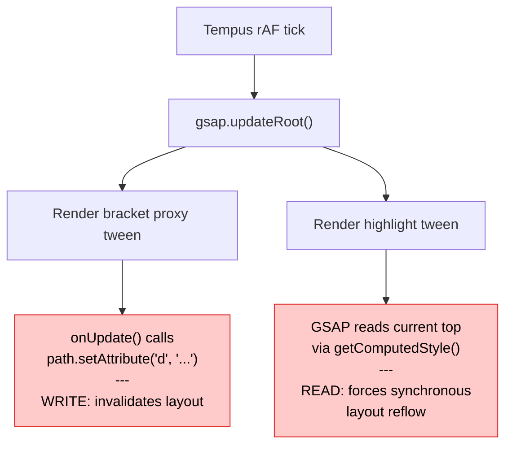

Layout thrashing is when JavaScript repeatedly writes to the DOM and then reads layout-dependent properties in the same frame, forcing the browser to recalculate layout synchronously instead of batching it. Each read-after-write cycle is called a **forced reflow**, and when they happen dozens or hundreds of times per frame, your animation goes from 60fps to slideshow.

This post breaks down two real cases we found and fixed in our codebase.

## How the browser renders a frame

The browser pipeline for a single frame looks like this:

```
JS → Style → Layout → Paint → Composite
```

Normally, **Layout** happens once per frame, after all JS has finished. The browser is smart — it batches DOM writes and computes layout once, right before painting.

But there's a catch: if your JS **writes** to the DOM (invalidating layout) and then **reads** a layout-dependent property, the browser can't defer the computation. It has to stop everything, compute layout **right now**, and return the value. That synchronous detour is a **forced reflow**.

One forced reflow is cheap. But if you do it in a loop — write, read, write, read — you force the browser to recalculate layout on every iteration. That's layout thrashing.

## What triggers it

**Writes** that invalidate layout (common examples):
- Setting `element.style.top`, `left`, `width`, `height`
- Setting `element.style.display`, `padding`, `margin`
- `element.setAttribute('d', ...)` on SVG paths
- `element.classList.add(...)` if it changes geometry
- `element.innerHTML = ...`

**Reads** that force layout (common examples):
- `element.offsetTop`, `offsetLeft`, `offsetWidth`, `offsetHeight`
- `element.getBoundingClientRect()`
- `getComputedStyle(element).top` (or any layout-dependent property)
- `element.scrollTop`, `scrollLeft`
- `element.clientWidth`, `clientHeight`
- SVG's `getTotalLength()`, `getBBox()`

If a write happens before a read in the same frame, the browser **must** synchronously recompute layout before it can answer the read. That's the forced reflow.

## The real bug: GSAP + `top` property

We caught this in a Chrome DevTools trace: **674 forced reflows in a single 11-second recording**, 91% from one function.

### The code

A footer component animated a highlight element on hover using GSAP:

```tsx showLineNumbers
// Position the highlight (initial setup)
gsap.set(highlight, {
  top: Math.round(labelRect.top - containerRect.top),
  left: labelRect.left - containerRect.left,
  width: labelRect.width,
  height: labelRect.height,
})

// Animate to new position on hover
gsap.to(highlight, {
  top: Math.round(highlightTop),   // <- this is the problem
  scaleX: targetWidth / baseWidth,
  duration: 0.3,
  ease: 'power2.out',
  overwrite: true,
})
```

A bracket SVG path was also being animated through a proxy object:

```tsx showLineNumbers
gsap.to(proxy, {
  top: bracketTop,
  duration: 0.3,
  onUpdate() {
    path.setAttribute('d', buildBracketPath(proxy.top, bottom, 20))
  },
})
```

Looks harmless. But here's what happened on **every animation frame**.

### The thrashing cycle

Our architecture uses [Tempus](https://github.com/darkroom-engineering/tempus) as a single `requestAnimationFrame` loop that dispatches to multiple subscribers in priority order: Lenis (smooth scroll) first, then GSAP, then ScrollSync, then R3F.

On each tick, GSAP's `updateRoot()` renders all active tweens. Here's the chain that played out every ~16ms:



**Step 1:** The bracket proxy tween fires its `onUpdate` callback, which calls `path.setAttribute('d', ...)`. This modifies the SVG DOM — layout is now **invalidated** (dirty).

**Step 2:** GSAP renders the highlight tween. To interpolate `top` from current to target, GSAP internally calls `getComputedStyle(element).top`. Because `top` is a layout-dependent CSS property and the layout is dirty from step 1, the browser is forced to **synchronously recompute layout** before it can return the value.

That's one forced reflow. And it happened every single frame for the duration of the animation — **674 times** across the recording.

### Why `top` is the problem

CSS `top` on a positioned element is a **layout property**. When GSAP needs to read its current value, the browser must have a valid layout to answer. If layout has been invalidated (by any prior DOM write in the same frame), the browser must synchronously recalculate it.

CSS `transform: translateY()` is a **composite property**. The browser can read transform values from the compositor without needing a layout pass. No layout dependency, no forced reflow.

### The fix

Replace `top`/`left` with GSAP's `y`/`x` shorthand, which maps to `translateY`/`translateX`:

```diff showLineNumbers
  gsap.set(highlight, {
-   top: Math.round(labelRect.top - containerRect.top),
-   left: labelRect.left - containerRect.left,
+   y: Math.round(labelRect.top - containerRect.top),
+   x: labelRect.left - containerRect.left,
    width: labelRect.width,
    height: labelRect.height,
  })

  gsap.to(highlight, {
-   top: Math.round(highlightTop),
+   y: Math.round(highlightTop),
    scaleX: targetWidth / baseWidth,
    duration: 0.3,
    ease: 'power2.out',
    overwrite: true,
  })
```

Now when GSAP renders the highlight tween, it reads `transform` instead of `top`. Transforms don't require layout, so even though the SVG path was just modified, no forced reflow happens. The browser batches the layout computation into the next natural paint.

The bracket proxy `onUpdate` that writes to the SVG path **stays as-is** — it was never the problem. It only **invalidated** layout. The problem was the **read** that followed.

## The second bug: GSAP + SVG `setAttribute`

Same codebase, different component. A Chrome DevTools trace showed **1,010 forced reflows in 7 seconds** — 413 in a single 1-second window — all from GSAP animating SVG gradient positions.

### The code

A `PulseLine` component sweeps a `<linearGradient>` down a vertical line by animating its `y1`/`y2` attributes:

```tsx showLineNumbers
tl.fromTo(
  pulseGradientEl,
  { attr: { y1: -40, y2: 0 } },
  { attr: { y1: 162, y2: 202 }, duration: 1, ease: 'none' }
)
```

A `usePulseConnections` hook does the same for diagonal connection lines, animating `x1`/`y1`/`x2`/`y2` on 9 gradient elements:

```tsx showLineNumbers
pulseTl.fromTo(
  gradientEl,
  { attr: { x1: fromX, y1: fromY, x2: fromX2, y2: fromY2 } },
  { attr: { x1: toX, y1: toY, x2: toX2, y2: toY2 }, duration: 0.8, ease: 'none' }
)
```

### Why `setAttribute` thrashes

This is a different mechanism than the `top` + `getComputedStyle` bug above. There's no explicit read/write interleaving in our code — the thrashing happens inside GSAP's `attr` plugin.

GSAP's `AttrPlugin` calls `element.setAttribute(name, value)` for each property, one by one. For SVG geometry attributes (`y1`, `y2`, `x1`, `x2` on `<linearGradient>`), each `setAttribute` call immediately **invalidates layout**. If the browser's rendering internals (or GSAP's nested render pipeline) touch anything layout-dependent between sets, a **synchronous layout** is forced.

The trace confirmed this — the thrashing came from GSAP's own render chain:

| Caller | Forced layouts |
|--------|---------------|
| `ut → render → i.render` (GSAP core render) | 620 |
| `render → i.render → i.render` (nested render) | 120 |
| `onUpdate → eg → i.render` (app callback) | 118 |

With 9 gradients × 2–4 attributes each × 60 frames/sec, you get hundreds of `InvalidateLayout → Layout` pairs per second. Each one is a synchronous detour in the middle of the animation tick.

### Why CSS custom properties don't thrash

`style.setProperty('--pulse-y1', '50')` doesn't invalidate layout. Custom properties are inert tokens — the browser doesn't know or care what they mean. It just marks the element's style as dirty and moves on.

The actual geometry change only happens later, when the browser resolves `y1: calc(var(--pulse-y1) * 1px)` during its **normal scheduled style recalculation** — once per frame, after all JS has finished. All variable updates within a single GSAP tick get batched into that one pass.

```
setAttribute('y1', '50')        → Immediate layout invalidation
setAttribute('y2', '90')        → Another invalidation, possible forced layout between

style.setProperty('--y1', '50') → Style marked dirty (no layout involved)
style.setProperty('--y2', '90') → Style marked dirty (no layout involved)
                                → Browser resolves both in one batched style recalc + layout
```

### The fix

**Step 1:** Add a CSS binding inside each SVG that maps custom properties to gradient geometry:

```tsx showLineNumbers
<defs>
  <style>{`
    [data-pulse-gradient] {
      x1: calc(var(--pulse-x1) * 1px);
      y1: calc(var(--pulse-y1) * 1px);
      x2: calc(var(--pulse-x2) * 1px);
      y2: calc(var(--pulse-y2) * 1px);
    }
  `}</style>
</defs>
```

This works because SVG 2 promotes `x1`/`y1`/`x2`/`y2` to CSS properties, so they can be set via stylesheets. The `calc(var(...) * 1px)` converts the unitless number from the custom property into a valid CSS `<length>`.

**Step 2:** Replace the SVG attributes on the gradient element with initial CSS custom properties:

```diff showLineNumbers
  <linearGradient
    id={pulseGradientId}
+   data-pulse-gradient
    x1="17.2998"
-   y1="-40"
    x2="17.2998"
-   y2="0"
    gradientUnits="userSpaceOnUse"
+   style={{ '--pulse-y1': -40, '--pulse-y2': 0 }}
  >
```

**Step 3:** Swap GSAP's `attr:` for CSS variable animation:

```diff showLineNumbers
  tl.fromTo(
    pulseGradientEl,
-   { attr: { y1: -40, y2: 0 } },
-   { attr: { y1: 162, y2: 202 }, duration: 1, ease: 'none' }
+   { '--pulse-y1': -40, '--pulse-y2': 0 },
+   { '--pulse-y1': 162, '--pulse-y2': 202, duration: 1, ease: 'none' }
  )
```

When GSAP encounters properties starting with `--`, it uses `element.style.setProperty()` instead of `setAttribute()`. No layout invalidation, no forced reflows. The ~1,010 synchronous layout pairs drop to zero.

## Rules of thumb

### 1. Separate reads from writes

If you need to read layout properties and write to the DOM, do **all reads first**, then **all writes**:

```tsx showLineNumbers
// GOOD: batch reads, then batch writes
const rect = element.getBoundingClientRect()  // read
const scroll = window.scrollY                  // read
element.style.transform = `translateY(${rect.top + scroll}px)`  // write

// BAD: interleaved reads and writes
element.style.top = '10px'                     // write
const height = element.offsetHeight            // read → FORCED REFLOW
element.style.top = `${height}px`              // write
const width = element.offsetWidth              // read → FORCED REFLOW AGAIN
```

### 2. Animate transforms, not layout properties

| Triggers layout (avoid animating) | Compositor-friendly (prefer these) |
|---|---|
| `top`, `left`, `right`, `bottom` | `transform: translate()` / GSAP `x`, `y` |
| `width`, `height` | `transform: scale()` / GSAP `scaleX`, `scaleY` |
| `margin`, `padding` | `transform: translate()` with visual offset |
| `font-size` | `transform: scale()` for visual effect |

### 3. Pre-calculate in event handlers, not in animation ticks

```tsx showLineNumbers
// GOOD: read layout once in the event handler, animate with transforms
function onMouseEnter() {
  const rect = target.getBoundingClientRect()  // one read, outside animation
  gsap.to(highlight, { y: rect.top, x: rect.left })
}

// BAD: let GSAP read layout on every frame by animating `top`
function onMouseEnter() {
  gsap.to(highlight, { top: rect.top })  // GSAP reads `top` every frame via getComputedStyle
}
```

### 4. Check for thrashing in DevTools

1. Open Chrome DevTools → **Performance** tab
2. Record a few seconds of interaction
3. Look for purple **Layout** blocks in the flame chart
4. If a Layout event has a **"Forced reflow"** warning and a stack trace, you've found thrashing
5. The stack trace tells you exactly which JS line triggered the read

## Further reading

- [What forces layout/reflow](https://gist.github.com/paulirish/5d52fb081b3570c81e3a) — Paul Irish's canonical list of properties that trigger layout
- [Avoid large, complex layouts and layout thrashing](https://web.dev/articles/avoid-large-complex-layouts-and-layout-thrashing) — web.dev deep dive
- [GSAP transforms vs CSS properties](https://gsap.com/docs/v3/GSAP/CoreConcepts/) — why GSAP's `x`/`y` are transform-based
