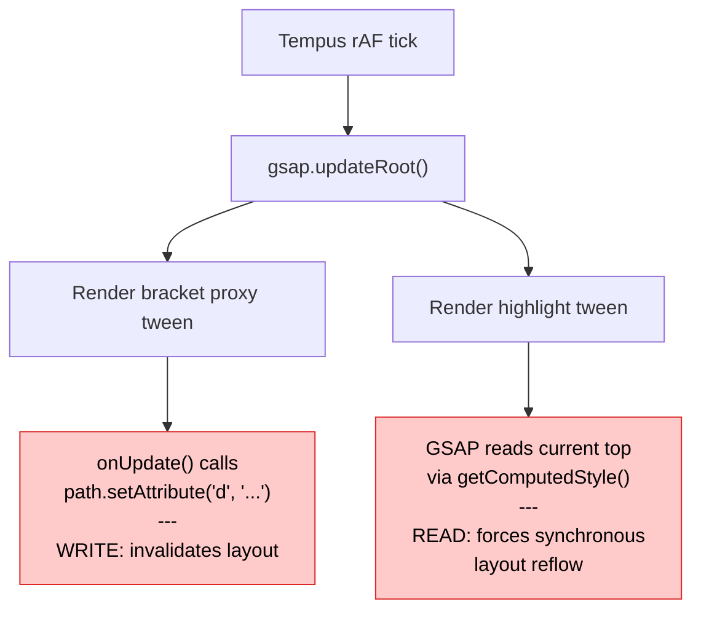

Layout thrashing is when JavaScript repeatedly writes to the DOM and then reads layout-dependent properties in the same frame, forcing the browser to recalculate layout synchronously instead of batching it. Each read-after-write cycle is called a **forced reflow**, and when they happen dozens or hundreds of times per frame, your animation goes from 60fps to slideshow.

This post breaks down a real case we found and fixed in our codebase.

## How the browser renders a frame

The browser pipeline for a single frame looks like this:

```
JS → Style → Layout → Paint → Composite
```

Normally, **Layout** happens once per frame, after all JS has finished. The browser is smart — it batches DOM writes and computes layout once, right before painting.

But there's a catch: if your JS **writes** to the DOM (invalidating layout) and then **reads** a layout-dependent property, the browser can't defer the computation. It has to stop everything, compute layout **right now**, and return the value. That synchronous detour is a **forced reflow**.

One forced reflow is cheap. But if you do it in a loop — write, read, write, read — you force the browser to recalculate layout on every iteration. That's layout thrashing.

## What triggers it

**Writes** that invalidate layout (common examples):
- Setting `element.style.top`, `left`, `width`, `height`
- Setting `element.style.display`, `padding`, `margin`
- `element.setAttribute('d', ...)` on SVG paths
- `element.classList.add(...)` if it changes geometry
- `element.innerHTML = ...`

**Reads** that force layout (common examples):
- `element.offsetTop`, `offsetLeft`, `offsetWidth`, `offsetHeight`
- `element.getBoundingClientRect()`
- `getComputedStyle(element).top` (or any layout-dependent property)
- `element.scrollTop`, `scrollLeft`
- `element.clientWidth`, `clientHeight`
- SVG's `getTotalLength()`, `getBBox()`

If a write happens before a read in the same frame, the browser **must** synchronously recompute layout before it can answer the read. That's the forced reflow.

## The real bug: GSAP + `top` property

We caught this in a Chrome DevTools trace: **674 forced reflows in a single 11-second recording**, 91% from one function.

### The code

A footer component animated a highlight element on hover using GSAP:

```tsx showLineNumbers
// Position the highlight (initial setup)
gsap.set(highlight, {
  top: Math.round(labelRect.top - containerRect.top),
  left: labelRect.left - containerRect.left,
  width: labelRect.width,
  height: labelRect.height,
})

// Animate to new position on hover
gsap.to(highlight, {
  top: Math.round(highlightTop),   // <- this is the problem
  scaleX: targetWidth / baseWidth,
  duration: 0.3,
  ease: 'power2.out',
  overwrite: true,
})
```

A bracket SVG path was also being animated through a proxy object:

```tsx showLineNumbers
gsap.to(proxy, {
  top: bracketTop,
  duration: 0.3,
  onUpdate() {
    path.setAttribute('d', buildBracketPath(proxy.top, bottom, 20))
  },
})
```

Looks harmless. But here's what happened on **every animation frame**.

### The thrashing cycle

Our architecture uses [Tempus](https://github.com/darkroom-engineering/tempus) as a single `requestAnimationFrame` loop that dispatches to multiple subscribers in priority order: Lenis (smooth scroll) first, then GSAP, then ScrollSync, then R3F.

On each tick, GSAP's `updateRoot()` renders all active tweens. Here's the chain that played out every ~16ms:



**Step 1:** The bracket proxy tween fires its `onUpdate` callback, which calls `path.setAttribute('d', ...)`. This modifies the SVG DOM — layout is now **invalidated** (dirty).

**Step 2:** GSAP renders the highlight tween. To interpolate `top` from current to target, GSAP internally calls `getComputedStyle(element).top`. Because `top` is a layout-dependent CSS property and the layout is dirty from step 1, the browser is forced to **synchronously recompute layout** before it can return the value.

That's one forced reflow. And it happened every single frame for the duration of the animation — **674 times** across the recording.

### Why `top` is the problem

CSS `top` on a positioned element is a **layout property**. When GSAP needs to read its current value, the browser must have a valid layout to answer. If layout has been invalidated (by any prior DOM write in the same frame), the browser must synchronously recalculate it.

CSS `transform: translateY()` is a **composite property**. The browser can read transform values from the compositor without needing a layout pass. No layout dependency, no forced reflow.

### The fix

Replace `top`/`left` with GSAP's `y`/`x` shorthand, which maps to `translateY`/`translateX`:

```diff showLineNumbers
  gsap.set(highlight, {
-   top: Math.round(labelRect.top - containerRect.top),
-   left: labelRect.left - containerRect.left,
+   y: Math.round(labelRect.top - containerRect.top),
+   x: labelRect.left - containerRect.left,
    width: labelRect.width,
    height: labelRect.height,
  })

  gsap.to(highlight, {
-   top: Math.round(highlightTop),
+   y: Math.round(highlightTop),
    scaleX: targetWidth / baseWidth,
    duration: 0.3,
    ease: 'power2.out',
    overwrite: true,
  })
```

Now when GSAP renders the highlight tween, it reads `transform` instead of `top`. Transforms don't require layout, so even though the SVG path was just modified, no forced reflow happens. The browser batches the layout computation into the next natural paint.

The bracket proxy `onUpdate` that writes to the SVG path **stays as-is** — it was never the problem. It only **invalidated** layout. The problem was the **read** that followed.

## Rules of thumb

### 1. Separate reads from writes

If you need to read layout properties and write to the DOM, do **all reads first**, then **all writes**:

```tsx showLineNumbers
// GOOD: batch reads, then batch writes
const rect = element.getBoundingClientRect()  // read
const scroll = window.scrollY                  // read
element.style.transform = `translateY(${rect.top + scroll}px)`  // write

// BAD: interleaved reads and writes
element.style.top = '10px'                     // write
const height = element.offsetHeight            // read → FORCED REFLOW
element.style.top = `${height}px`              // write
const width = element.offsetWidth              // read → FORCED REFLOW AGAIN
```

### 2. Animate transforms, not layout properties

| Triggers layout (avoid animating) | Compositor-friendly (prefer these) |
|---|---|
| `top`, `left`, `right`, `bottom` | `transform: translate()` / GSAP `x`, `y` |
| `width`, `height` | `transform: scale()` / GSAP `scaleX`, `scaleY` |
| `margin`, `padding` | `transform: translate()` with visual offset |
| `font-size` | `transform: scale()` for visual effect |

### 3. Pre-calculate in event handlers, not in animation ticks

```tsx showLineNumbers
// GOOD: read layout once in the event handler, animate with transforms
function onMouseEnter() {
  const rect = target.getBoundingClientRect()  // one read, outside animation
  gsap.to(highlight, { y: rect.top, x: rect.left })
}

// BAD: let GSAP read layout on every frame by animating `top`
function onMouseEnter() {
  gsap.to(highlight, { top: rect.top })  // GSAP reads `top` every frame via getComputedStyle
}
```

### 4. Check for thrashing in DevTools

1. Open Chrome DevTools → **Performance** tab
2. Record a few seconds of interaction
3. Look for purple **Layout** blocks in the flame chart
4. If a Layout event has a **"Forced reflow"** warning and a stack trace, you've found thrashing
5. The stack trace tells you exactly which JS line triggered the read

## Further reading

- [What forces layout/reflow](https://gist.github.com/paulirish/5d52fb081b3570c81e3a) — Paul Irish's canonical list of properties that trigger layout
- [Avoid large, complex layouts and layout thrashing](https://web.dev/articles/avoid-large-complex-layouts-and-layout-thrashing) — web.dev deep dive
- [GSAP transforms vs CSS properties](https://gsap.com/docs/v3/GSAP/CoreConcepts/) — why GSAP's `x`/`y` are transform-based
