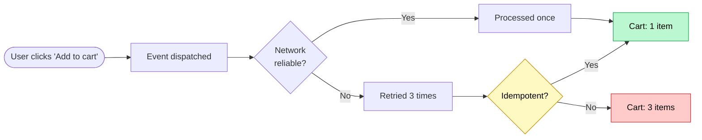
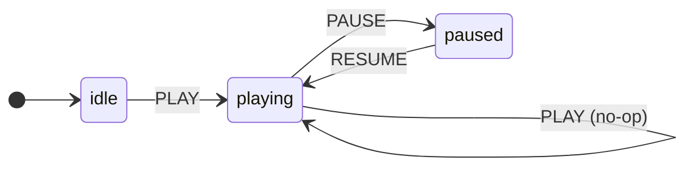
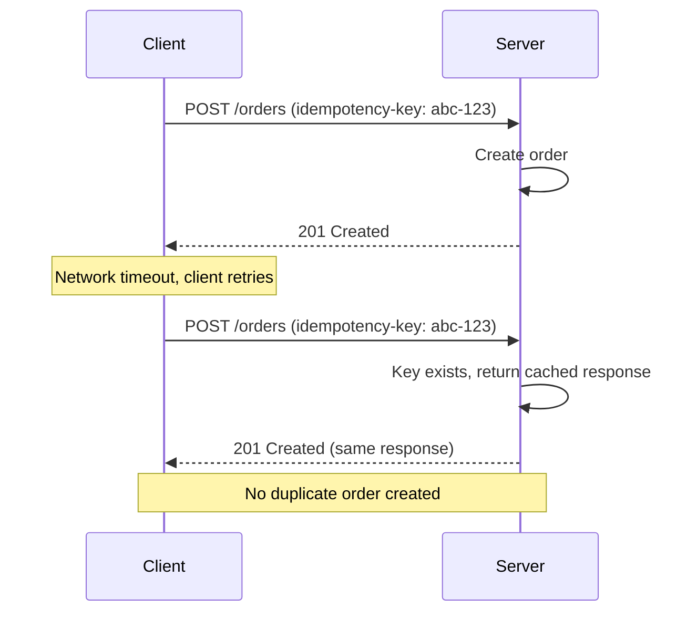

A user double-clicks "Add to cart". The network hiccups and your fetch retries. React's `StrictMode` fires your effect twice in dev. A WebSocket reconnects and replays the last few messages. None of these are exotic — they're Tuesday. And every one of them runs the same state update more than once.

The question that decides whether that's fine or a bug: **if this update runs twice, do you end up in the same place as running it once?**

If yes, your update is **idempotent**. If no, you've got a duplicate item in the cart, an unread count that keeps climbing, and a Slack thread titled "can't reproduce".

```ts
// Idempotent: same result no matter how many times it runs
user.role = 'admin'
user.role = 'admin'
user.role = 'admin'
// user.role === 'admin'

// Not idempotent: the result depends on how many times it ran
user.loginCount += 1
user.loginCount += 1
user.loginCount += 1
// user.loginCount === 3, when you meant 1
```

That's the whole idea. The interesting part is that real state updates run an unpredictable number of times, so "runs exactly once" is an assumption you don't actually get to make.



## The traps

Almost every non-idempotent bug comes from the same root: the update describes a **change** instead of a **destination**. Three flavors show up over and over.

**Relative updates.** The classic append:

```ts
case 'ADD_ITEM':
  return { ...state, items: [...state.items, action.payload] } // appends every time
```

Fire `ADD_ITEM` twice for the same product and you've got two of them. The state tracks how many times the action ran, not what the user wanted.

**Toggles.** Logic that flips based on the current value:

```ts
function toggleFavorite(state, productId) {
  if (state.favorites.includes(productId)) {
    return state.favorites.filter((id) => id !== productId)
  }
  return [...state.favorites, productId]
}
```

Once: favorited. Twice: unfavorited. Three times: favorited again. The outcome is a function of the call count, which is exactly the thing you don't control.

**Increments.** Anything that accumulates:

```ts
dispatch({ type: 'INCREMENT_UNREAD', count: 1 })
```

Let a reconnection replay that event and your unread badge keeps ticking up while no new messages arrived.

```mermaid
flowchart TD
    subgraph nonIdem ["Non-Idempotent"]
        N1["State: 0 items"] --> N2["ADD_ITEM (shirt)"]
        N2 --> N3["State: 1 item"]
        N3 --> N4["ADD_ITEM (shirt)<br/>(retry)"]
        N4 --> N5["State: 2 items"]
    end

    subgraph idem ["Idempotent"]
        I1["State: 0 items"] --> I2["SET_ITEM (shirt, id:abc)"]
        I2 --> I3["State: 1 item"]
        I3 --> I4["SET_ITEM (shirt, id:abc)<br/>(retry)"]
        I4 --> I5["State: 1 item"]
    end

    style N5 fill:#fecaca,stroke:#dc2626,color:#000
    style I5 fill:#bbf7d0,stroke:#16a34a,color:#000
    style nonIdem fill:#fef2f2,stroke:#dc2626,color:#000
    style idem fill:#f0fdf4,stroke:#16a34a,color:#000
```



## The fix is always the same shape

Stop describing the delta. Describe the destination. Three patterns cover basically everything.

**Key by identity, not position.** Arrays append; maps overwrite. Swap the array for an object keyed by a unique id and duplicates collapse on their own:

```ts
case 'SET_ITEM':
  return {
    ...state,
    items: { ...state.items, [action.payload.id]: action.payload }, // same id, same slot
  }
```

Dispatch `SET_ITEM` with the same id ten times and you get one item. The id does the deduplication for free.

**Declare intent instead of toggling.** Split the toggle into two explicit actions that each name a target state:

```ts
case 'SET_FAVORITE':
  return { ...state, favorites: new Set([...state.favorites, action.payload.id]) }
case 'UNSET_FAVORITE': {
  const next = new Set(state.favorites)
  next.delete(action.payload.id)
  return { ...state, favorites: next }
}
```

Adding an id that's already in a `Set` is a no-op. Deleting one that isn't there is a no-op. Both run safely as many times as you like.

**Set absolute values, not deltas.** When a number comes from somewhere authoritative, take the number, not the change:

```ts
// Not idempotent
dispatch({ type: 'INCREMENT_UNREAD', by: 5 })

// Idempotent — the server already knows the answer
dispatch({ type: 'SET_UNREAD_COUNT', count: 12 })
```

Don't recompute locally what the server already knows. Let it be the source of truth and just mirror it.

## State machines get it for free

For anything with distinct modes — a media player, a wizard, a dialog — you don't have to bolt idempotency on. A state machine has it built in: a transition from state A on event X always lands in state B, no matter how many X's you throw at it.



Notice the self-loop: `PLAY` while already `playing` just keeps you `playing`. Hammer the play button, fire the event off a key repeat, replay it from a restored session — the machine stays put. No double playback, no stacked side effects. It guards itself.

```ts
type PlayerState = 'idle' | 'playing' | 'paused'

type PlayerAction = { type: 'PLAY' } | { type: 'PAUSE' } | { type: 'RESUME' }

function playerReducer(state: { status: PlayerState }, action: PlayerAction) {
  switch (state.status) {
    case 'idle':
      if (action.type === 'PLAY') return { status: 'playing' as const }
      return state // nothing else means anything from idle

    case 'playing':
      if (action.type === 'PAUSE') return { status: 'paused' as const }
      return state // PLAY again while playing? no-op

    case 'paused':
      if (action.type === 'RESUME') return { status: 'playing' as const }
      return state
  }
}
```

The trick is the `return state` lines: events that don't fit the current state are ignored. Duplicates literally can't do anything.

## Carry it through to the API

Idempotency doesn't stop at the client. The moment an action becomes a network mutation, the same retry problem shows up — a `POST /orders` that times out and retries can create two orders. The fix is an **idempotency key**: a unique id minted on the client, sent with the request, that the server uses to recognize a repeat and replay the original response instead of doing the work again.



The one thing that matters on the client: generate the key **once**, before the request, and reuse it across retries. A fresh key per attempt defeats the whole point.

```ts
async function placeOrder(cart: Cart) {
  const idempotencyKey = crypto.randomUUID()

  return fetchWithRetry('/api/orders', {
    method: 'POST',
    headers: { 'Idempotency-Key': idempotencyKey },
    body: JSON.stringify(cart),
  })
}
```

### What the server actually does

The client side is the easy half. The dedup happens on the server, and it's worth being precise about how, because the obvious implementation has a race in it.

The server keeps a small store — a database table or a Redis entry — keyed by the idempotency key. Each record tracks the status of that operation and, once it finishes, the response to replay:

```ts
type KeyRecord = {
  key: string // the Idempotency-Key header
  status: 'running' | 'done'
  response?: { status: number; body: unknown } // filled in once the work completes
}
```

The handler then does three things in order: claim the key, do the work, save the response.

```ts showLineNumbers
async function handleOrder(req: Request) {
  const key = req.headers['idempotency-key']

  // 1. Claim the key atomically. The insert fails if the key already exists,
  //    so exactly one request ever gets to be the "first" one.
  const claimed = await db.insertIfAbsent({ key, status: 'running' })

  if (!claimed) {
    // Someone already holds this key. Either it finished (replay the response)
    // or it's a near-simultaneous retry still in flight (tell the client to wait).
    const existing = await db.get(key)
    return existing.status === 'done'
      ? existing.response
      : { status: 409, body: { error: 'request already in progress' } }
  }

  // 2. We won the claim, so we do the work — exactly once.
  const order = await createOrder(req.body)
  const response = { status: 201, body: order }

  // 3. Save the response against the key so every retry replays it.
  await db.update(key, { status: 'done', response })
  return response
}
```

The whole thing hinges on step 1 being **atomic**. A plain "check if the key exists, then insert if not" has a gap between the check and the insert where two retries both see nothing and both create an order — the exact duplicate you were trying to kill. So you don't check-then-write; you push the check _into_ the write and let the database be the referee: a unique constraint on the key column, `INSERT ... ON CONFLICT DO NOTHING`, or Redis `SET key … NX`. One writer wins, everyone else falls through to the replay path.

Two refinements real implementations add:

- **A TTL on the key.** Records don't live forever — Stripe expires theirs after 24 hours, say. Long enough to outlast any retry, short enough that the store doesn't grow without bound.
- **A request fingerprint.** Store a hash of the request body next to the key. If the same key shows up with a _different_ body, that's a client bug — a key reused for a new operation — so you reject it instead of silently replaying the wrong response.

## Putting it together

Here's a cart reducer where every operation is idempotent by construction — keyed items, absolute quantities, and a tiny state machine for the save flow:

```tsx showLineNumbers
'use client'

type CartItem = {
  id: string
  name: string
  price: number
  quantity: number
}

type CartState = {
  items: Record<string, CartItem> // keyed by id, not an array
  status: 'idle' | 'saving' | 'saved' | 'error'
}

type CartAction =
  | { type: 'SET_ITEM'; item: CartItem }
  | { type: 'REMOVE_ITEM'; id: string }
  | { type: 'SET_QUANTITY'; id: string; quantity: number }
  | { type: 'SAVE_START' }
  | { type: 'SAVE_SUCCESS' }
  | { type: 'SAVE_ERROR' }

function cartReducer(state: CartState, action: CartAction): CartState {
  switch (action.type) {
    case 'SET_ITEM':
      // same id always lands in the same slot
      return { ...state, items: { ...state.items, [action.item.id]: action.item } }

    case 'REMOVE_ITEM': {
      // removing a missing key does nothing
      const { [action.id]: _, ...rest } = state.items
      return { ...state, items: rest }
    }

    case 'SET_QUANTITY':
      // absolute quantity, never a delta
      if (!state.items[action.id]) return state
      return {
        ...state,
        items: {
          ...state.items,
          [action.id]: { ...state.items[action.id], quantity: action.quantity },
        },
      }

    case 'SAVE_START':
      return { ...state, status: 'saving' }
    case 'SAVE_SUCCESS':
      return { ...state, status: 'saved' }
    case 'SAVE_ERROR':
      return { ...state, status: 'error' }

    default:
      return state
  }
}
```

Replay any of these as many times as you want — same input, same state. That's the whole property.

## Rules of thumb

| Rule | Why |
|------|-----|
| **Key everything by unique id** | Maps and Sets deduplicate on their own. Arrays don't. |
| **Set absolute values, not deltas** | `SET_COUNT(5)` is idempotent. `INCREMENT(1)` is not. |
| **Replace toggles with explicit intent** | `SET_FAVORITE` / `UNSET_FAVORITE` over `TOGGLE_FAVORITE`. |
| **Use state machines for mode-based flows** | Impossible states become unrepresentable; duplicate events become no-ops. |
| **Send idempotency keys with mutations** | The server can safely deduplicate retries. |
| **Trust the server for derived values** | Don't locally compute what it already knows. |

The shortcut for all of it: if you can answer *"what should the state be?"* instead of *"how should the state change?"*, you're writing idempotent code. Worth doing anytime an update can fire more than once — clicks, effects, sockets, retries, optimistic updates. Less worth the ceremony when you're rendering pure UI from props or just mirroring a single source of truth with no local mutation.
