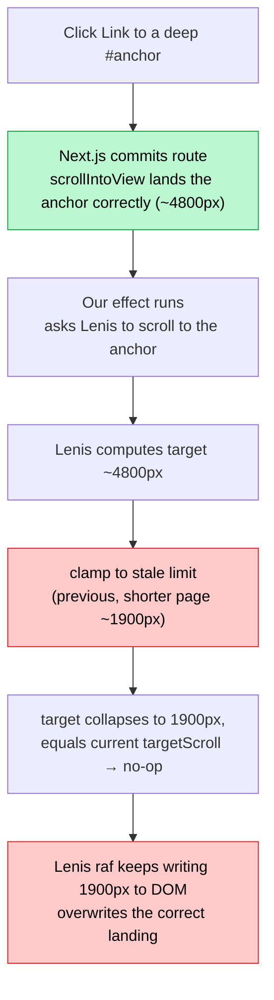

## The problem

You have a link that points at an anchor deep down another page, something like `/other-page#section-near-the-bottom`. Click it, and instead of landing on that section, you end up somewhere in the middle of the page, the target nowhere in sight. It's a client-side navigation (an in-app `<Link>`), not a full reload.

Load the same URL fresh in the address bar, or hit it via browser back/forward, and it works. Only the in-app click fails, and only when the page you're landing on is *taller* than the page you left.

That last detail is the whole bug. It just doesn't look like it yet.

## What you assume is happening

The obvious suspects, in order, are all wrong, and each one is wrong in a way that costs you a debugging session if you trust it:

- **"Next.js isn't scrolling to the anchor."** It is. The App Router calls `scrollIntoView` on the target element at route commit, and it lands it *correctly*. If you log the scroll position at that moment, the anchor is right where it should be.
- **"There's a layout shift pushing the section down."** There isn't. The document height is stable through the whole settle. Nothing is growing under the anchor.
- **"It's the trackpad momentum from the flick carrying into the new page."** Plausible, and it even contributes a little jitter, but kill momentum entirely and the section still lands off-screen.

Every one of these is a confident, reasonable hypothesis. Every one is falsified the moment you put a real log on the running page. Hold that thought; it's half the lesson.

(This site drives scroll through [Lenis](https://lenis.darkroom.engineering/), so the specifics below are Lenis's, but the shape of the bug belongs to any library that caches the page's dimensions.)

## What is actually happening

Lenis sits between your code and the browser's native scroll. To convert a `scrollTo(element)` request into a pixel offset, and to clamp scrolling at the top and bottom of the page, it needs to know **how tall the page is**.

Measuring the page is expensive: reading `scrollHeight` forces the browser to flush layout. So Lenis does the sensible thing: it measures once into a `Dimensions` object, **caches** it, and only re-measures when something tells it to (a window resize, one of its ResizeObservers firing, or a manual `lenis.resize()`). The cached height and the derived scroll limit look like this (from `lenis` 1.3.23):

```js
onContentResize = () => {
  this.scrollHeight = this.content.scrollHeight  // ← measured once, then cached
  this.scrollWidth = this.content.scrollWidth
}

get limit() {
  return {
    x: this.scrollWidth - this.width,
    y: this.scrollHeight - this.height,          // ← max scroll, from the cache
  }
}
```

Here's the trap. A client-side navigation swaps the page content without firing any of the events that would invalidate that cache. So at the instant you navigate from a short page to a tall one, Lenis is still holding the **short page's** `scrollHeight`, and therefore the short page's `limit`.

Now watch what `scrollTo(element)` does with a stale limit. This is the real Lenis code that computes the target and then clamps it:

```js
// element position in the viewport, mapped to an absolute scroll offset
target =
  rect.top +
  this.animatedScroll -
  scrollMargin -
  scrollPadding
// ...
} else target = clamp(0, target, this.limit)   // ← this.limit is stale

if (target === this.targetScroll) {
  onStart?.(this)
  onComplete?.(this)
  return                                        // ← early-out: does nothing
}
```

The real target for the section is around `4800px`. But `this.limit` still reflects the previous, shorter page, say `1900px`. So `clamp(0, 4800, 1900)` drags the target down to `1900`. Worse, `1900` happens to equal the `targetScroll` Lenis is already sitting at, so the `target === this.targetScroll` guard fires and `scrollTo` **returns having done nothing at all**, while Lenis's animation loop keeps writing its current `animatedScroll` (`1900`) to the DOM, **overwriting the correct landing Next.js had already done.**

The section isn't failing to be reached. It's being reached by Next.js, and then a stale number clamps our correction into a no-op and drags the page back to the bottom of a page that no longer exists.



## The fix

Re-measure before you ask Lenis to scroll:

```ts
if (location.hash) {
  lenis.resize() // refresh cached dimensions to the NEW page

  // resolve the element ourselves: scrollTo(hashString) runs querySelector
  // internally, which throws on ids that start with a digit
  const el = document.getElementById(location.hash.slice(1))
  if (el) lenis.scrollTo(el, { immediate: true, force: true })
}
```

The load-bearing line is `lenis.resize()`. It re-reads the document height so the clamp is computed against the page you actually landed on, not the one you left. Everything else is detail: resolving the element by id (rather than letting Lenis `querySelector` it, which chokes on numeric ids), and `immediate` because you're correcting a landing, not animating a journey to it.

Two things make this cheap and safe rather than a sledgehammer:

- **It's one forced reflow, once per navigation.** The expensive part of `resize()` is reading `scrollHeight`. On a route change the browser is already doing a full layout for the new page, so one extra read is noise. This is *not* the per-frame read/write interleaving that causes [layout thrashing](/logs/11-wtf-is-layout-thrashing); it's a single measurement at a single moment.
- **Gate it to the case that needs it.** Only a hash target depends on the height being correct. A plain navigation scrolls to `0`, and `clamp(0, 0, anything)` is `0` no matter how stale the cache is. So the resize only earns its keep on hash links; everywhere else, skip it.

## The lesson worth keeping

Two, actually.

**A cache of a physical measurement is a bug waiting for the thing it measured to change.** Any library that caches layout (scroll height, element bounds, container size) is making a bet that it will be told when to re-measure. Client-side navigation is exactly the event that slips past that contract: the DOM changes wholesale, but none of the resize signals fire. Whenever you use a library that snapshots the DOM, ask *when does it re-measure, and does my framework's navigation trigger that?* If the answer is "no," you re-measure by hand at the boundary.

**Your repro can confirm a false theory.** The first three hypotheses each had a headless reproduction that "passed", because a headless run on a different data set produced a page whose height didn't happen to trigger the clamp. The bug only appeared when the *previous* page was shorter than the target on the *next* page, a relationship the synthetic environment didn't reproduce. The theories only died when the logs came from the real machine, placed *inside the effect*, printing the actual numbers: `window.scrollY = 5430` (correct) sitting right next to `lenis.animatedScroll = 1900` (stale), a contradiction no amount of reading the source would have surfaced. Reading code gives you plausible stories. A logged value that contradicts itself gives you the truth. When they disagree, the log wins.
