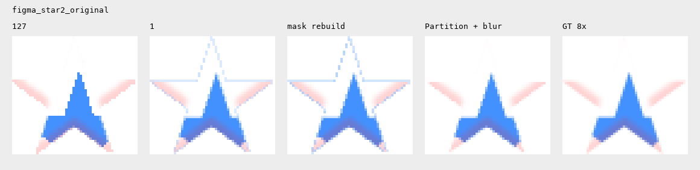
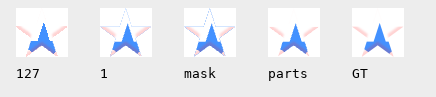
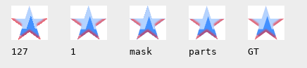
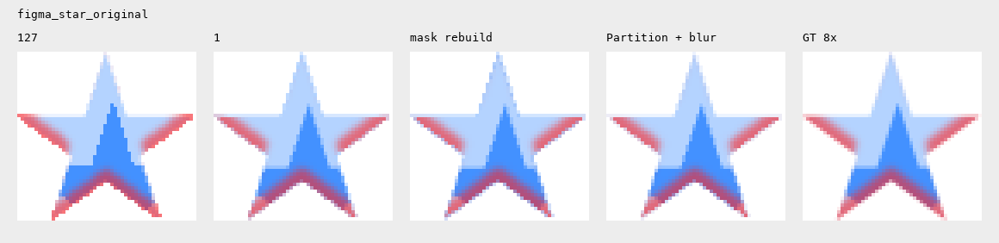
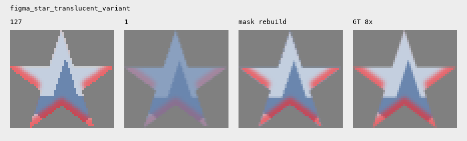
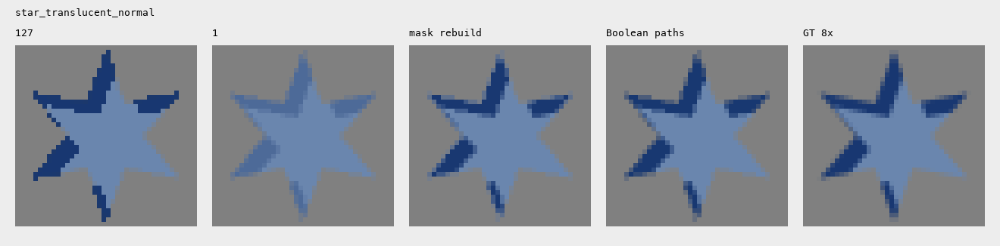

# Validación de hardAlpha: 127 → 1

## Resultado

**El cambio es un buen primer arreglo, pero no conserva todas las sombras.** `Star 1.svg` mejora con `=1`, incluso con dos sombras y blur. El segundo original aportado, `Star2.svg`, **sí muestra una franja azul con `=1` alrededor del rim blanco**. La máscara del post agrava esa franja; dividir el relleno y el rim en regiones vectoriales independientes la elimina en ese borde. Además, con relleno semitransparente, `=1` puede reducir mucho la intensidad de las sombras.

Se midieron 37 casos en Google Chrome **153.0.8010.52**, con Playwright **1.62.0**. Los resultados son específicos de estos fixtures y este renderer. La referencia aproxima el SVG original, **no es una captura de Figma** ni demuestra fidelidad a su renderizador.

## Star2: el halo reproducible y la reconstrucción que lo elimina

[Star2.svg](../Star2.svg) conserva forma, offsets y blur del primer SVG, pero usa sombra blanca al 100% y roja al 20%. No se cambió el relleno opaco ni el blend mode normal.





| Star2, error de borde |   127 |     1 | Máscara del post | Regiones + blur |
| --------------------- | ----: | ----: | ---------------: | --------------: |
| Fondo blanco          | 10.01 | 11.16 |            15.42 |        **5.41** |
| Fondo gris            | 27.98 |  9.51 |            15.84 |        **7.52** |
| Fondo oscuro          | 49.65 | 14.40 |            18.63 |       **13.07** |

En fondo blanco el rim blanco original se confunde con el fondo; `=1` deja ver una línea azul alrededor de la punta superior y los bordes horizontales. **Menos aliasing y más fidelidad no son equivalentes en todos los píxeles.** En la banda ancha, `=1` mejora globalmente aun con esa franja: `9.04 → 6.08`; regiones + blur mejora más, a **3.60**. Por eso no alcanza con RMSE global para descartar un defecto localizado.

El candidato **Regiones + blur** calcula `S ∩ S_desplazada` para el relleno azul y `S − S_desplazada` para el rim blanco. Son paths disjuntos: no hay una silueta azul completa debajo del borde blanco. La segunda sombra roja conserva su perfil difuso mediante una máscara con blur. Es una reconstrucción híbrida, no un SVG completamente libre de filtros ni una solución automática para cualquier diseño.

Con la referencia 32×, el error de borde sobre blanco es `10.54 / 11.24 / 15.44 / 5.19`: la ventaja de la reconstrucción se conserva. El orden entre 127 y 1 puede cambiar con el promedio en luz lineal; la franja visible y la ventaja de la reconstrucción permanecen.

Archivos listos para comparar: [Star2-alpha1.svg](../Star2-alpha1.svg) y [Star2-rebuilt.svg](../Star2-rebuilt.svg). Ambos conservan fondo transparente; los fondos de las imágenes son controles de medición.

### Dónde nace esa franja

En un píxel del borde blanco con cobertura `A`, `=1` produce una sombra blanca con alpha aproximadamente `A` sobre el relleno azul que también tiene alpha `A`. El blend normal deja una contribución azul proporcional a `A × (1 − A)`. Con `A=0.5`, sobrevive 0.25 de contribución azul premultiplicada: sobre blanco se ve celeste. El problema está en superponer esas coberturas, no en que la resta aritmética multiplique dos alphas.

La máscara del post aplica además la máscara a otro path antialiasado, reduciendo aún más la cobertura del blanco en ese borde. Separar las regiones evita que haya azul debajo del rim blanco. Esta explicación corresponde al tramo blanco de este fixture; no afirma que todos los blend modes o sombras produzcan la misma franja.

## La estrella exportada de Figma

Original: [Star 1.svg](../Star%201.svg). Arreglo mínimo: [Star 1-alpha1.svg](../Star%201-alpha1.svg); únicamente se modificaron los dos multiplicadores de alpha.

El SVG mide 52 × 49, tiene relleno opaco `#4391FF` y dos inner shadows en modo `normal`:

- Blanca, opacidad 0.6, offset `(2, 15)`, sin blur.
- Roja, opacidad 0.6, offset `(0, -4)`, `stdDeviation=1`.

Comparación al tamaño rasterizado original: 127 / 1 / máscara / regiones + blur / referencia.



Ampliación nearest-neighbor del mismo render, sin volver a rasterizar el SVG:



### Error de borde, RMSE RGB 0–255: menor es mejor

| Caso                                    |   127 |         1 | Reconstrucción con máscaras |
| --------------------------------------- | ----: | --------: | --------------------------: |
| Estrella original, fondo blanco         | 18.68 |  **9.32** |                       13.26 |
| Original, fondo gris                    | 17.68 |  **8.36** |                       13.16 |
| Original, fondo oscuro                  | 30.24 | **13.22** |                       15.91 |
| Variante: ambas sombras en overlay      | 12.68 |  **8.49** |                        9.38 |
| Variante: fill-opacity 0.36, fondo gris | 17.54 |     30.31 |                   **10.35** |

La variante semitransparente cambia exclusivamente `fill-opacity` del path fuente a `0.36`; el fondo gris es común a todos sus candidatos y referencias. **No es el archivo original**, ni una exportación adicional obtenida de Figma.



La banda ancha que incluye las sombras da el mismo orden: original `10.67 / 4.90 / 6.82`; variante semitransparente `10.00 / 21.68 / 5.38`. Por tanto, la conclusión no depende de medir solamente el filo exterior.

La referencia 32× confirma las diferencias: original `19.78 / 9.28 / 12.72`; semitransparente `18.53 / 29.89 / 9.38`. La diferencia entre referencias 16× y 32× es 0.72 y 0.76 respectivamente. También se probaron tamaños 24 × 23 y 104 × 98: `=1` conserva la ventaja en la estrella original.

## Blur, blend modes y geometría real

Los siguientes son fixtures controlados, reconstruidos para este experimento; no reproducen exactamente los tests de 40px de la minuta porque sus fuentes no estaban disponibles. Sus números no se deben comparar directamente con aquella tabla.

| Caso controlado                                  |   127 |         1 | Máscaras | Paths booleanos |
| ------------------------------------------------ | ----: | --------: | -------: | --------------: |
| Estrella, sombra normal, offset diagonal 2.1/2.1 | 33.49 |     11.89 |    12.56 |       **10.59** |
| Estrella, sombra normal, blur 2                  | 27.21 | **11.18** |    11.44 |             N/A |
| Estrella, emboss overlay, offsets ±0.6           | 23.24 |     12.85 | **9.78** |           10.44 |
| Estrella, overlay con blur 2                     | 15.52 |      8.40 | **7.89** |             N/A |
| Estrella, multiply con blur 2                    | 27.33 | **11.48** |    11.90 |             N/A |
| Estrella, relleno 0.36, sombra normal            | 15.74 |     22.15 |     8.08 |        **4.06** |
| Estrella, relleno 0.36, sombra normal, blur 2    | 11.97 |     18.84 | **7.08** |             N/A |
| Estrella, relleno 0.36, overlay grueso y blur 2  | 14.40 |     17.55 | **6.66** |             N/A |

Las diferencias pequeñas no son victorias robustas: en el blur normal, cambiar la referencia de 8× a 16× invierte el orden entre `=1` y máscaras. Con overlay en 64px y blur 2, `=1` supera a máscaras. Por eso «sombra compleja ⇒ geometría siempre mejor» tampoco se sostiene.

La columna **Máscaras** implementa el enfoque del post: silueta blanca, copia negra desplazada y path coloreado enmascarado, con el mismo orden de capas y blend mode. Para conservar blur, la copia negra lleva un filtro gaussiano. Esto sigue usando composición rasterizada y, cuando corresponde, filtros.

La columna **Paths booleanos** resta los polígonos antes del render y dibuja el contorno resultante como un path, sin máscara ni filtro. Se calculó con Shapely 2.1.2 para sombras de borde duro. Este candidato todavía superpone el rim sobre un relleno completo; es diferente de la partición que corrige Star2. No se equipara un rim duro a una sombra difusa: las celdas con blur quedan sin ese candidato.



## Qué explica el contraejemplo

`SourceAlpha` incorpora la opacidad del relleno. En el interior de un path con `fill-opacity=0.36`, el multiplicador 127 lleva ese valor a 1; el multiplicador 1 conserva 0.36. Al desplazar, difuminar y restar, se cambia la intensidad de toda la banda. No se recupera únicamente el antialiasing perdido.

Esto explica por qué el contraejemplo persiste al supersamplear: en la estrella semitransparente, los filtros `127` y `1`, ambos renderizados a 16× y reducidos, todavía difieren **29.64** RMSE en el borde. En la original opaca difieren **1.11**. La opacidad aplicada después del filtro a un grupo completo es otro caso y no debe confundirse con `fill-opacity` que ya forma parte de `SourceAlpha`.

Hay que corregir dos afirmaciones del borrador:

1. `×127` no es literalmente un umbral binario: los alpha positivos menores que `1/127` pueden seguir siendo fraccionales.
2. La operación `feComposite` con `k2=-1`, `k3=1` es una resta clamped, `max(in2 − in, 0)`. No es la multiplicación `0.5 × 0.5 = 0.25` usada para explicar el supuesto halo. Una máscara aplicada a otro path sí puede multiplicar coberturas, pero es otra operación. Véase la [especificación de feComposite](https://www.w3.org/TR/filter-effects-1/#feCompositeElement) y [feColorMatrix](https://www.w3.org/TR/filter-effects-1/#feColorMatrixElement).

No se deduce de estos tests por qué Figma eligió 127. Star2 verifica una franja causada por la superposición de coberturas, pero no demuestra una motivación oficial del exportador ni un defecto universal del cambio a 1.

## Recomendación editorial

> Probá primero cambiar el multiplicador de alpha de 127 a 1. Puede corregir gran parte del escalonado, incluso con varias sombras, blur o overlay. Revisalo al tamaño final y sobre el fondo donde va a vivir: si aparece una franja de color o cambia la intensidad del efecto, reconstruí el relleno y los rims como regiones independientes, evitando apilar coberturas antialiasadas en el borde. Las sombras difusas necesitan conservar su perfil de blur. Los rellenos semitransparentes requieren especial atención porque el cambio también modifica la intensidad de la sombra.

La geometría queda como solución completa para el caso verificado donde el arreglo mínimo deja una franja, no como una garantía universal para todo efecto. A pedido del usuario, el log 19 se actualizó con esta recomendación, las ilustraciones verificadas y la distinción entre máscaras y regiones booleanas.

## Antecedentes públicos consultados

- [Figma Forum, Junky borders when exporting in SVG, 26 de abril de 2024](https://forum.figma.com/ask-the-community-7/junky-borders-when-exporting-in-svg-33951): reporte de primera mano sobre franjas al exportar sombras y un workaround que separa geometría de relleno y stroke. No identifica específicamente el multiplicador 127 ni constituye una explicación oficial.
- [AlignUI, Avatar](https://www.alignui.com/docs/v1.2/ui/avatar): código publicado que usa `SourceAlpha`, el multiplicador 127 y `hardAlpha` en un filtro de inner shadow. Confirma el patrón en código público, pero no explica la elección del número.
- [W3C, Filter Effects](https://www.w3.org/TR/filter-effects-1/) y [Compositing and Blending](https://www.w3.org/TR/compositing-1/): definiciones primarias de la matriz, la resta aritmética y la composición source-over.

Las búsquedas por `hardAlpha`, `127`, Figma, halo y antialiasing no localizaron una explicación autorizada de Figma sobre la elección de 127 ni una garantía para el reemplazo por 1. Eso describe el alcance de la búsqueda, no prueba que tal explicación no exista. No se usaron artículos genéricos o copias de código como evidencia del motivo del exportador.

## Metodología y límites

1. El SVG se carga como imagen en Google Chrome y se dibuja en canvas a sus dimensiones nativas, con perfil sRGB forzado. No se rasteriza con resvg, librsvg ni sharp. Screenshots del triángulo y las dos estrellas originales como SVG inline coinciden exactamente con canvas: diferencia máxima de canal **0** en los tres controles.
2. La referencia es el filtro original `127` renderizado a 8× y reducido por promedio de bloques exacto. Se compara también 16×; para las dos estrellas adjuntas se agrega 32×. Es una aproximación al límite de resolución del filtro original, no una verdad de diseño independiente de ese filtro.
3. Los fondos son opacos y se componen en Chrome antes de medir RGB, evitando el RGB indefinido de píxeles transparentes. Todos los candidatos conservan el espacio de filtros sRGB del original.
4. La métrica principal usa una banda común derivada de la silueta sin sombras a 16×: píxeles de cobertura parcial y vecinos de la frontera binaria, dilatados un píxel. Se exportan las máscaras. La banda ancha suma alcance de offset y tres desviaciones de blur. Para rims muy anchos puede abarcar todo el icono; por eso se informa junto con la banda estrecha.
5. `results.json` incluye RMSE con referencias 8× y 16×, ambas bandas y sensibilidad al promedio en luz lineal a 16×. Las diferencias pequeñas pueden cambiar con la referencia o el resampling; los contraejemplos fuertes de relleno semitransparente y el resultado de la estrella original se conservan. El control de espacio de color se apoya en el log [Color Spaces sRGB & Linear de JOYCO](https://hub.joyco.studio/logs/10-color-spaces-srgb-linear).
6. Se incluyen tamaños 16/24/40/64px, fases subpíxel, un offset cero, fondos blanco/gris/oscuro y los tres SVG aportados. Variar el tamaño escala el SVG entero: los parámetros no se mantienen en píxeles físicos constantes. No se probaron Safari, Firefox, sombras exteriores ni exportaciones nuevas de Figma con relleno semitransparente.

Los scripts previos recuperados en `/private/tmp` están en `legacy/`, sólo para auditar su procedencia. Fabricaban el before por umbralización manual y usaban sharp para otros renders. No se ejecutaron para esta medición y no se deben usar como evidencia de Chrome. Los originales de Desktop siguen inaccesibles por la restricción de macOS.

## Reproducción

Los scripts `render.cjs`, `boolean.py` y `analyze.py` están junto a este informe. Los SVG renderizados, PNG nativos, referencias, máscaras de medición y ampliaciones están en `renders/`. Los parámetros completos están en `cases.json` y `manifest.json`; todos los resultados en `results.json`.

Dependencias: Chrome instalado, Node con Playwright 1.62.0, Python con NumPy 2.4.6, Pillow 12.0.0 y Shapely 2.1.2. `analyze.py` usa la fuente Menlo de macOS. Shapely sólo es necesario para regenerar los paths booleanos; sus resultados ya se guardaron en `boolean-paths.json`.

Para preparar dependencias aisladas desde la raíz del repositorio:

```sh
npm install --prefix .context/hardalpha-tools --no-save playwright@1.62.0
python3 -m venv .context/hardalpha-venv
.context/hardalpha-venv/bin/python -m pip install -r temp/hardalpha-validation/requirements.txt
export PLAYWRIGHT_PATH="$PWD/.context/hardalpha-tools/node_modules/playwright"
WRITE_CASES_ONLY=1 node temp/hardalpha-validation/render.cjs
.context/hardalpha-venv/bin/python temp/hardalpha-validation/boolean.py
node temp/hardalpha-validation/render.cjs
.context/hardalpha-venv/bin/python temp/hardalpha-validation/analyze.py
.context/hardalpha-venv/bin/python temp/hardalpha-validation/publish.py
```

Los scripts no necesitan ejecutar el hub ni modificar sus dependencias. Los renders intermedios nativos y supersampleados se regeneran y están ignorados por git; las comparaciones, fixtures, parámetros, paths calculados y resultados numéricos sí se conservan en el repositorio.
