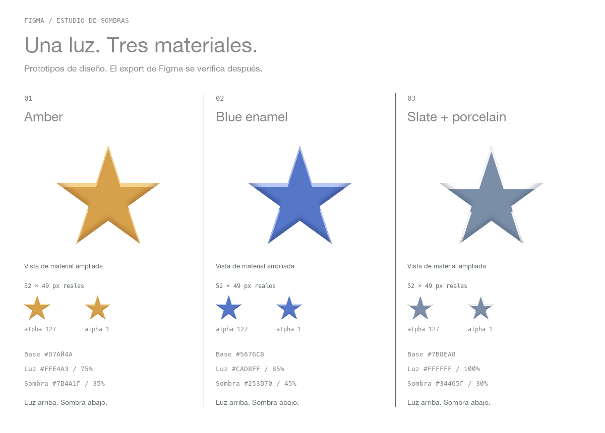
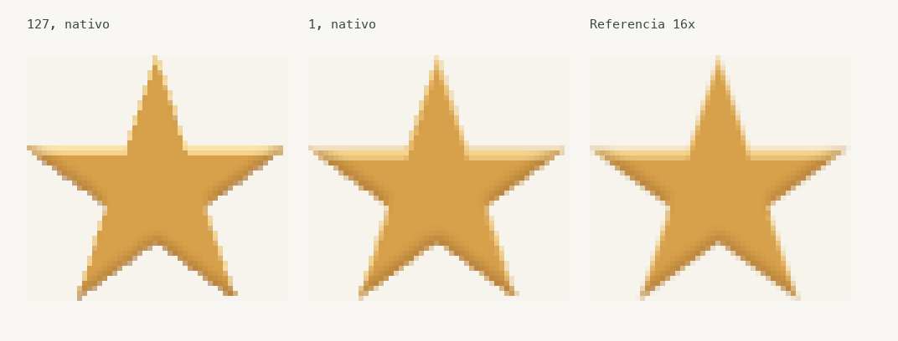
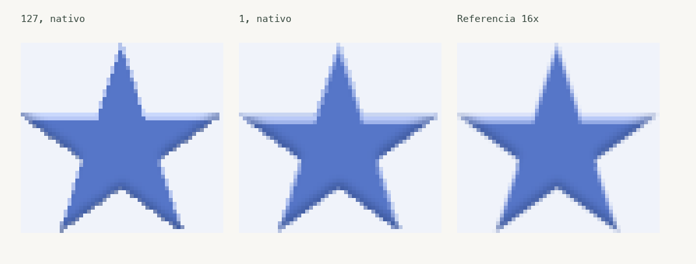
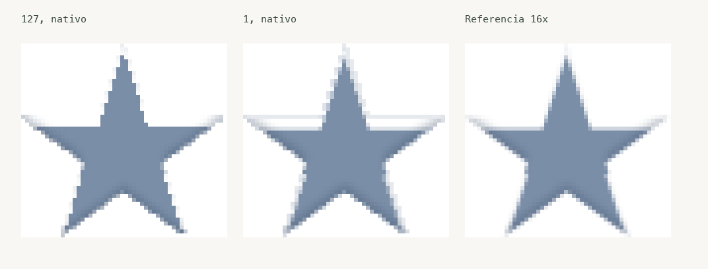

# Estrellas para reexportar desde Figma

Tres propuestas con una misma forma, luz superior y sombras de la misma familia de color. Recomiendo **Amber** para explicar el arreglo simple y **Slate + porcelain** para investigar el halo. **Blue enamel** es una alternativa de paleta al ámbar.



La fila grande muestra el material ampliado y rerasterizado. La fila pequeña conserva renders de 52 × 49 píxeles. Estos son **prototipos SVG generados localmente y renderizados en Chrome**, no nuevas exportaciones de Figma. No reemplazan todavía las pruebas del artículo.

Los SVG, previews individuales y la lámina de propuestas tienen fondo transparente. Las comparaciones de diagnóstico de abajo conservan fondos controlados para que el cambio de alpha se pueda evaluar sobre la misma superficie.

## Armarlos en Figma

1. Importá [star-base.svg](star-base.svg). No tiene filtros. Conservá un frame de exportación de **52 × 49**, sin fondo, sin clipping y sin escalar el path. Duplicalo para cada material.
2. Seleccioná el path interior. Dejá fill y layer opacity al **100%**, sin stroke, y cambiá el fill según la receta.
3. Agregá dos efectos **Inner shadow**, en modo **Normal**, con spread **0**. La sombra oscura debe componerse encima del rim claro. Aplicá los valores de abajo al path, no al frame.
4. Para evaluar el aspecto, usá placas de fondo externas al frame exportable. El ejemplo de halo necesita también una placa blanca.
5. Exportá cada frame como SVG. Exportá además PNG a **1× y 8×** desde Figma: eso permite contrastar el export con el aspecto del canvas sin asumir que un SVG supersampleado es la referencia de Figma.

No importes los SVG con filtros para usarlos como reemplazo de los efectos editables. Los archivos `*-alpha127.svg` y `*-alpha1.svg` son sólo previews técnicas.

## 01. Amber

Fill **#D7A04A**. Placa de preview **#F7F4ED**.

| Efecto        | Color   | Opacidad |   X |   Y | Blur |
| ------------- | ------- | -------: | --: | --: | ---: |
| Rim claro     | #FFE4A3 |      75% |   0 |   2 |    0 |
| Sombra oscura | #7B4A1F |      35% |   0 |  -2 |    2 |

El rim conserva el tono cálido del material. La sombra tiene suficiente contraste para leer el borde sin dominar toda la estrella.



## 02. Blue enamel

Fill **#5676C8**. Placa de preview **#F0F3FA**.

| Efecto        | Color   | Opacidad |   X |   Y | Blur |
| ------------- | ------- | -------: | --: | --: | ---: |
| Rim claro     | #CAD8FF |      85% |   0 |   2 |    0 |
| Sombra oscura | #253B70 |      45% |   0 |  -2 |    2 |

Misma dirección de luz que Amber, con luces azuladas y sombra índigo. Evita introducir un segundo color que parezca otro material.



## 03. Slate + porcelain

Fill **#7B8EA8**. Placa de preview **#FFFFFF**.

| Efecto        | Color   | Opacidad |   X |   Y | Blur |
| ------------- | ------- | -------: | --: | --: | ---: |
| Rim claro     | #FFFFFF |     100% |   0 |   3 |    0 |
| Sombra oscura | #34465F |      30% |   0 |  -2 |    2 |

El blanco al 100% es deliberado: permite ver si el color de la base se filtra por el borde al cambiar a alpha 1. El offset de 3px conserva ese control con un bisel mucho más fino que el ejemplo anterior de 15px.



## Qué verificar en los nuevos exports

- Que cada sombra conserve su matriz `hardAlpha` y que editar 127 a 1 sea el único cambio del candidato simple.
- Que el orden de los efectos, sus offsets y opacidades coincidan con el diseño. Los prototipos componen la sombra oscura después de la clara.
- Que el blur exportado conserve el perfil previsto. El preview local usa `stdDeviation=1` para la sombra suave; la receta propone Blur 2 en Figma y la conversión debe comprobarse en el archivo nuevo.
- Que la comparación se haga al tamaño original y sobre el mismo fondo. Las imágenes ampliadas de diagnóstico parten del render de 1× con nearest-neighbor.

Las comparaciones de esta carpeta usan como tercera columna el filtro original a 16×, reducido por promedio de bloques. Eso ayuda a elegir ejemplos, pero sigue sin ser una captura del canvas de Figma.

## Regenerar los previews

Con las dependencias de `../hardalpha-validation/README.md`:

```sh
node temp/star-design-kit/build.cjs
python3 temp/star-design-kit/preview.py
```

`PLAYWRIGHT_PATH` debe apuntar al módulo Playwright instalado. Chrome y las fuentes de macOS deben estar disponibles. Los colores y valores están definidos en `build.cjs` y se guardan en `recipes.json`.

Referencia de los controles: [Figma, Apply effects to layers](https://help.figma.com/hc/en-us/articles/360041488473-Apply-effects-to-layers).
